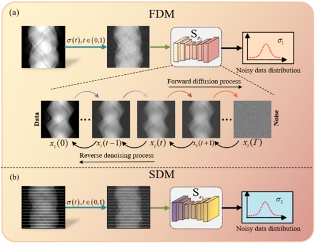
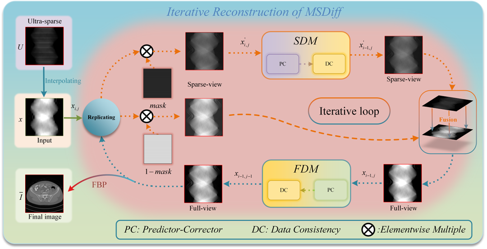
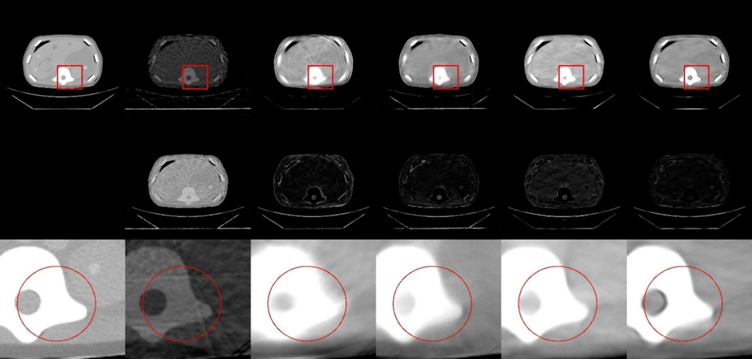
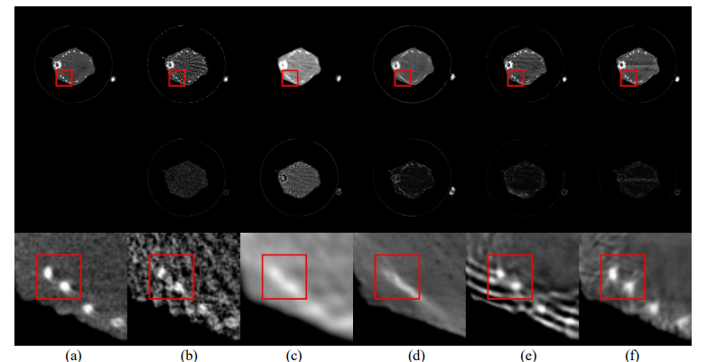

# MSDiff
**Paper**: Multi-Scale Diffusion Model for Ultra-Sparse View CT Reconstruction     
**Authors**: Junyan Zhang, Mengxiao Geng, Pinhuang Tan, Yi Liu, Zhili Liu, Bin Huang, Qiegen Liu    
Physics in Medicine & Biology


**Abstract**: Computed Tomography (CT) technology reduces radiation exposure to the human body through sparse sampling, but fewer sampling angles pose challenges for image reconstruction. When the projection angles are significantly reduced, the quality of image reconstruc-tion deteriorates. To improve the quality of image reconstruction under sparse angles, an ultra-sparse view CT reconstruction method utilizing multi-scale diffusion models is proposed. This method aims to focus on the global distribution of information while facilitating the reconstruction of local image features in sparse views. Specifically, the proposed model ingeniously combines information from both comprehensive sampling and selective sparse sampling techniques. By precisely adjusting the diffusion model, diverse noise distribu-tions are extracted, enhancing the understanding of the overall image structure and assisting the fully sampled model in recovering image information more effectively. By leveraging the inherent correlations within the projection data, an equidistant mask is designed according to the principles of CT imaging, allowing the model to focus attention more efficiently. Experimental results demonstrate that the multi-scale model approach significantly improves image reconstruction quality under ultra-sparse views and exhibits good gener-alization across multiple datasets.

**Index Terms**—Computed tomography, multi-diffusion model, ultra-sparse view reconstruction, sinogram domain.

## Linear measurement process for sparse-view CT 


## Visualization of the diffusion process of MSDiff in the projection domain

 

## Pipeline of the ultra-sparse view reconstruction procedure in MSDiff



## Reconstruction images with 30 views from CIRS Phantom Data



(a) The reference image, (b) FBP, (c) U-Net, (d) FBPConvNet, (e) GMSD, (f) MSDiff. 

## Reconstruction images with 50 views from Preclinical Mouse Data



(a) The reference image, (b) FBP, (c) U-Net, (d) FBPConvNet, (e) GMSD, (f) MSDiff. 

## Training
Full-view Diffusion Model (FDM)
```bash
python main_720.py --config=aapm_sin_ncsnpp_720.py --workdir=exp_fd --mode=train --eval_folder=result
```

Sparse-view Diffusion Model (SDM)
```bash
python main_120.py --config=aapm_sin_ncsnpp_120.py --workdir=exp_sd --mode=train --eval_folder=result
```

## Test
```bash
python PCsampling_demo.py
```

     
### Other Related Projects
<div align="center">  </div>   
    
  * Generative Modeling in Sinogram Domain for Sparse-view CT Reconstruction      
[<font size=5>**[Paper]**</font>](https://ieeexplore.ieee.org/document/10233041)   [<font size=5>**[Code]**</font>](https://github.com/yqx7150/GMSD)

  * One Sample Diffusion Model in Projection Domain for Low-Dose CT Imaging  
[<font size=5>**[Paper]**</font>](https://ieeexplore.ieee.org/abstract/document/10506793)   [<font size=5>**[Code]**</font>](https://github.com/yqx7150/OSDM)

  * Iterative Reconstruction for Low-Dose CT using Deep Gradient Priors of Generative Model  
[<font size=5>**[Paper]**</font>](https://ieeexplore.ieee.org/abstract/document/9703672)   [<font size=5>**[Code]**</font>](https://github.com/yqx7150/EASEL)   [<font size=5>**[PPT]**</font>](https://github.com/yqx7150/HGGDP/tree/master/Slide)
    
  * REDAEP: Robust and Enhanced Denoising Autoencoding Prior for Sparse-View CT Reconstruction  
[<font size=5>**[Paper]**</font>](https://ieeexplore.ieee.org/document/9076295)   [<font size=5>**[Code]**</font>](https://github.com/yqx7150/REDAEP)   [<font size=5>**[PPT]**</font>](https://github.com/yqx7150/HGGDP/tree/master/Slide)

  * Wavelet-improved score-based generative model for medical imaging  
[<font size=5>**[Paper]**</font>](https://ieeexplore.ieee.org/abstract/document/10288274)

  * 基于深度能量模型的低剂量CT重建  
[<font size=5>**[Paper]**</font>](http://cttacn.org.cn/cn/article/doi/10.15953/j.ctta.2021.077)   [<font size=5>**[Code]**</font>](https://github.com/yqx7150/EBM-LDCT)  

 * Stage-by-stage Wavelet Optimization Refinement Diffusion Model for Sparse-view CT Reconstruction  
[<font size=5>**[Paper]**</font>](https://ieeexplore.ieee.org/abstract/document/10403850)   [<font size=5>**[Code]**</font>](https://github.com/yqx7150/SWORD)

  * Dual-Domain Collaborative Diffusion Sampling for Multi-Source Stationary Computed Tomography Reconstruction  
[<font size=5>**[Paper]**</font>](https://ieeexplore.ieee.org/document/10577271)   [<font size=5>**[Code]**</font>](https://github.com/lizrzr/DCDS-Dual-domain_Collaborative_Diffusion_Sampling)

  * Low-rank Angular Prior Guided Multi-diffusion Model for Few-shot Low-dose CT Reconstruction     
[<font size=5>**[Paper]**</font>](https://ieeexplore.ieee.org/abstract/document/10776993)   [<font size=5>**[Code]**</font>](https://github.com/yqx7150/PHD)

  * Physics-informed DeepCT: Sinogram Wavelet Decomposition Meets Masked Diffusion  
[<font size=5>**[Paper]**</font>](https://arxiv.org/abs/2501.09935)   [<font size=5>**[Code]**</font>](https://github.com/yqx7150/SWARM)    
                    
  * MSDiff: Multi-Scale Diffusion Model for Ultra-Sparse View CT Reconstruction  
[<font size=5>**[Paper]**</font>](https://arxiv.org/pdf/2405.05763)   [<font size=5>**[Code]**</font>](https://github.com/yqx7150/MSDiff)

  * Ordered-subsets Multi-diffusion Model for Sparse-view CT Reconstruction      
[<font size=5>**[Paper]**</font>](https://arxiv.org/abs/2505.09985)
                          
  * Virtual-mask Informed Prior for Sparse-view Dual-Energy CT Reconstruction  
[<font size=5>**[Paper]**</font>](https://arxiv.org/abs/2504.07753)   [<font size=5>**[Code]**</font>](https://github.com/yqx7150/VIP-DECT)

  * Raw_data_generation  [<font size=5>**[Code]**</font>](https://github.com/yqx7150/Raw_data_generation)

  * PRO: Projection Domain Synthesis for CT Imaging  [<font size=5>**[Paper]**</font>](https://arxiv.org/pdf/2506.13443)   [<font size=5>**[Code]**</font>](https://github.com/yqx7150/PRO)
       
  * UniSino: Physics-Driven Foundational Model for Universal CT Sinogram Standardization[<font size=5>**[Paper]**</font>](https://arxiv.org/abs/2508.17816)   [<font size=5>**[Code]**</font>](https://github.com/yqx7150/UniSino)

  * Diffusion Models for Medical Imaging
[<font size=5>**[Paper]**</font>](https://github.com/yqx7150/Diffusion-Models-for-Medical-Imaging)   [<font size=5>**[Code]**</font>](https://github.com/yqx7150/Diffusion-Models-for-Medical-Imaging)   [<font size=5>**[PPT]**</font>](https://github.com/yqx7150/HKGM/tree/main/PPT) 


